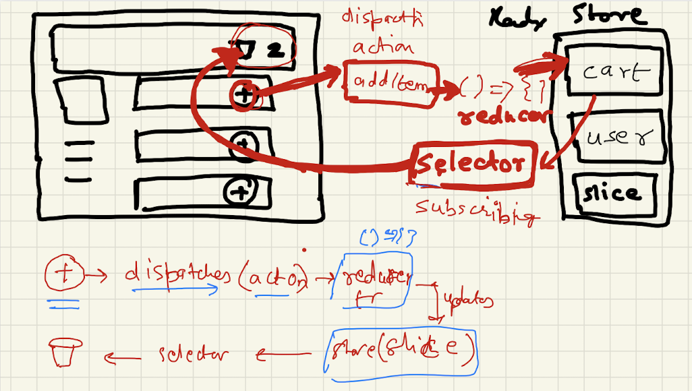

# 12 - Let's build our store

Today, it was all about handling data using external state management library Redux. We discussed the problems with other ways of data management like Props drilling and Context API. Importance of Redux, Redux Toolkit vs React-Redux and step by step configuration and implementation of React Redux were done in this chapter.

While Creating `food ordering app` covered:

- How Redux works? (i.e `Redux Toolkit Architecture`(RTK))
- Build our  Store (using `configureStore()`)
- Create Slice (using `createSlice()`)
- Provided `redux store` to the application. (using `<Provider store={}/>`)
- Subscribe the store (using `useSelector()`)
  - **Don't** subscribe to whole store, **only** subscribe to portion of slice in store (to avoid re-render)
- Dispatch an Action (using `useDispatch()`)
- Browser extension for `Redux Dev Tools`
- Read documentation for: `RTK Query`, `Middlewares`, `Thunks`

## Notes:

- [Notes.md](./notes.md)

## Theory:

<!-- *******************************-->
<details>
<summary>useContext vs Redux.</summary><br>
<blockquote>

Both **useContext** and **Redux** are used to solve `props drilling`, a problem faced while passing props between components. 

   | Context API | Redux  | 
   | :----    | :------ | 
   |`Context` provides a way to share values between components (throughout the application) without having to explicitly pass a prop through every level of the tree.    | Redux is a central store for storing the data of the applications. | 
   | Context API is `built-in React tool` and does not have to be downloaded separately  | Redux is an `third-party` open source library `not part of React` which provides a central `store`, and actions to modify the store.  | 
   | Requires minimal Setup | Requires extensive setup to integrate it with a React Application  | 
   | Specifically designed for static data, that is not often refreshed or updated | Usefule for both static and dynamic data | 
   | Difficult to debug | Easy to debug using Redux dev tool |
   | Useful for small projects | Useful for larger projects |
</blockquote><br>
</details>

<!-- *******************************-->
<details>
<summary>Advantage of using Redux Toolkit over Redux.</summary><br>
<blockquote>

1. `Abstraction and Convenience:` Redux Toolkit provides a set of abstractions and conveniences on top of regular Redux, which make it easier to work with and manage the state of your application. This includes features such as the `createSlice` function for creating slices of state and its associated `actions and reducer`, and the `createStore` function for creating a `Redux store` with pre-configured middleware and enhancers.

2. `Immutable updates:` Regular Redux requires you to create a `new state object` every time you make an update, which can become repetitive and error-prone. Redux Toolkit provides a way to `update the state immutably`, using its built-in `createSlice` function.

3. `Simplified Reducers:` In regular Redux, you write your `own reducers`, which can become complex and difficult to manage as your application grows. With Redux Toolkit, you can use the `createSlice` function to generate reducers for you, based on the state updates you define.

4. `Improved Performance:` Redux Toolkit uses advanced performance optimizations, such as memoization, lazy evaluation, and selective updates, to make your application faster and more efficient.

5. `Better Debugging:` Redux Toolkit provides better debugging tools, such as the ability to log and replay actions, inspect the current state of your application, and easily track the changes made to your state over time.
</blockquote><br>
</details>

<!-- *******************************-->
<details>
<summary>Explain Dispatcher.</summary><br>
<blockquote>

A dispatcher is a `function` that dispatches actions to the store.  In Redux, actions are used to describe changes to the state, and dispatching an action is the way to trigger those changes.

   - How to create & use dispatcher function ? 

   ```
   const dispatch = useDispatch();
   ```

   This hook returns a reference to the `dispatch function` from the `Redux` store. You may use it to dispatch actions as needed.

   ```
   dispatch(actionCreator(data)); // returns an action payload object 
   ``` 

   When you dispatch an action creator, it returns an `action object` that the `reducer function` uses to update the `state`. The dispatcher function is used to dispatch the action creator and which in turns calls the reducer function to trigger the update.
</blockquote><br>
</details>

<!-- *******************************-->
<details>
<summary>Explain Reducer.</summary><br>
<blockquote>

A reducer is a `pure function` in Redux that takes the `current state` of your application and an `action`, and returns a `new state` based on that `action`.

Example : 
   ```javascript
   addItem: (state, action) => {
      const item = state.items[action.payload.id];
      const quantity = item && item.hasOwnProperty('quantity')
        ? state.items[action.payload.id]?.quantity + 1 : 1;
      state.items[action.payload.id] = { ...action.payload, quantity };
      state.totalItemsCount = state.totalItemsCount + 1;
   },
   ```

   Here based on the action object, the state is updated inside teh reducer function.
</blockquote><br>
</details>

<!-- *******************************-->
<details>
<summary>Explain slice.</summary><br>
<blockquote>

In Redux Toolkit, a `slice` is a piece of the state that is managed by a single set of actions and reducer.
</blockquote><br>
</details>

<!-- *******************************-->
<details>
<summary>Explain selector.</summary><br>
<blockquote>

- A `selector` is a pure `function` that takes the current `state` of your application and returns a derived value based on that state. 

- `useSelector` is a hook from the `react-redux` library that allows you to `subscribe` to the `state` of your Redux store from a React component.  
- The `useSelector` hook takes a `selector function` as its argument, which is used to extract data from the state tree. 
- The component will re-render whenever the state of your Redux store changes and the derived value returned by the selector function changes.

```javascript
const totalItemsCount = useSelector(store => store.cart.totalItemsCount);
```

`store => store.cart.totalItemsCount` is the selector function which *returns* the `totalItemsCount` from the *state*. 
Now, useSelector() is used to subscribe to this totalItemsCount from the state.
</blockquote><br>
</details>

<!-- *******************************-->
<details>
<summary>Explain createSlice and the configuration it takes.</summary><br>
<blockquote>

The `createSlice` function is used to create a store slice, a piece of the store.

The  `createSlice` function takes an `object` as an argument, which contains the following properties:

- `name:` A string that represents the name of the slice.
- `initialState:` An `object` that represents the `initial state` of the slice. In our cartSlice example, the initial state is an object with two properties: `items` (an empty object) and `totalItemsCount` (which is 0).
- `reducers:` An `object` that contains the Redux reducers for the slice. Reducers are functions that take the current `state` and an `action`, and return a new state based on the action type and payload. In our example, there are three reducers: addItem, removeItem, and clearCart.

After creating the slice, the code `exports` the `actions` that can be dispatched on the store. In this example, there are three actions: addItem, removeItem, and clearCart.

Finally, the code `exports` the `reducer` for the slice using the reducer property of the slice. The reducer is responsible for managing the state of the slice and updating it in response to dispatched actions.
</blockquote><br>
</details>
<!-- *******************************-->

## Coding:

<ul>
	<li>Practice making a store, slices and do read and write operations using Redux Store</li>
	<li>Build Cart Flow using Redux Store<br>
	 </li>
</ul>

## Quick Code Reference

| Project | Tech Stack | Source Code |
| --- | --- | --- |
| Food Delivery App | React | <ul><li>- [x] utils/[store.js](./src/utils/store.js)</li><li>- [x] utils/[cartSlice.js](./src/utils/cartSlice.js)</li><li>- [x] [App.js](./src/App.js)</li><li>- [x] [Header.js](./src/components/Header.js)</li><li>- [x] [RestaurantMenu.js](./src/components/RestaurantMenu.js)</li><li>- [x] [Cart.js](./src/components/Cart.js)</li></ul> |

## Quick Recap

When `we click on Add Button`, we `dispatch an action`, which `calls a reducer function`, which `updates the slice of the store` & for reading data, `we subscribe the store`. Then, `it automagically updates`. 

<p></p>

</div>
