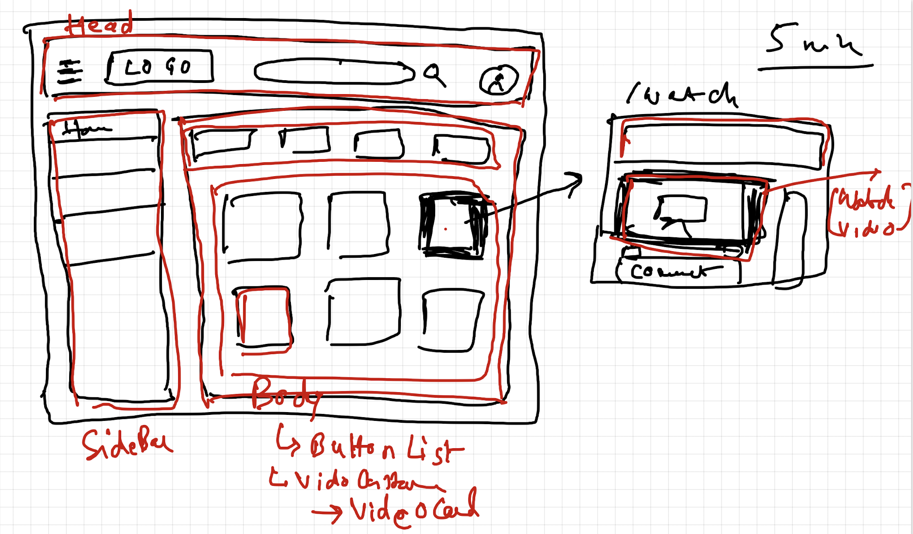

# 14 - Machine Coding Interview

This chapter helps us to prepare for machine coding round of interview. How to practice, plan and develop an app in the Live Coding interview.

## Notes:

- [Notes.md](https://github.com/deltanode/react-playground/blob/main/14-machine-coding-interview/notes.md)

## Try it Yourself:

<ul>
	<li>Build YouTube</li>
	<li>Speak while you code</li>
	<li>Keep a timer when you are building</li>
	<li>Record yourself and share the link of your recording on #assignment channel on discord</li>
</ul>

## References:

- Code for YouTube app - <a href="https://bitbucket.org/namastedev/my-youtube/src/master/" rel="noreferrer noopener" role="button" tabindex="0" target="_blank" title="https://bitbucket.org/namastedev/my-youtube/src/master/">https://bitbucket.org/namastedev/my-youtube/src/master/</a>

